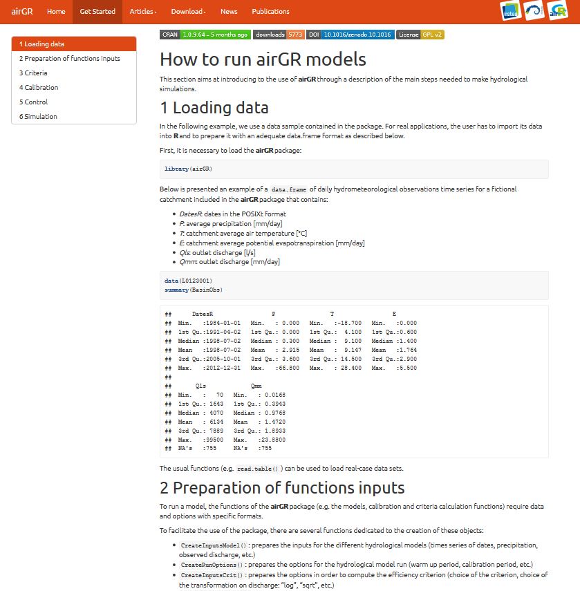

<!-- =========================== -->


<style>
.column-left{
  float: left;
  width: 50%;
  text-align: left;
}
.column-right{
  float: right;
  width: 50%;
  text-align: right;
}
</style>


<!-- =========================== -->


```{r include=FALSE}
formatGR      <- '<strong><font color="#009EE0">%s</font></strong>'
GR4J          <- sprintf(formatGR, "GR4J")
airGR         <- sprintf(formatGR, "airGR")
airGRteaching <- sprintf(formatGR, "airGRteaching")
pathSrc <- "01_src"
```


<!-- =========================== -->


# Introduction

## Introduction

Hydrological modelling packages in 

- topmodel
- dynatopmodel
- TUWmodel
- Ecohydmod
- hydromad (not on CRAN)
- etc.

... and of course `r airGR` & `r airGRteaching`


<!-- =========================== -->


# airGR(teaching) Models & Tools


## Models


### GR hydrological models

Rainfall-runoff lumped models developed since the 90's at IRSTEA

- annual: GR1A
- month: GR2M
- day: `r GR4J`, GR5J, GR6J
- hour: GR4H

### Snow model

- CemaNeige

<font color="#009EE0">
<br>
More about GR models: poster A.9
<br>[EGU2018-15734]
<br>Thursday, "History of Hydrology" session
</font>


<!-- ============ -->


## Tools

### Error criteria

- RMSE
- Nash-Sutcliffe
- KGE
- KGE'

### Calibration algorithm

- Housemade global then local optimisation


<!-- =========================== -->


# Dataset input

## Dataset preparation
```{r, message = FALSE, echo = FALSE, warning = FALSE, eval = FALSE}
pathFiles <- list.files(pathSrc, pattern = "BasinObs.*csv", full.names = TRUE)
listObs <- lapply(pathFiles, function(i) {
  iObs <- read.table(i, header = TRUE, sep = ",")
  iObs <- iObs[, c("DATE", "PRECIP", "PET", "FLOW_mmday", "TEMP")]
  colnames(iObs) <- c("Date", "P", "E", "Qmm", "T")
  iObs$Date <- as.POSIXct(iObs$Date, tz = "UTC")
  iObs$Basin <- gsub("(.*)(\\d{5})([.]csv)", "\\2", basename(i))
  return(iObs)
})
dfObs <- do.call("rbind", listObs)
dfObs = dfObs[(dfObs$Basin == "12001" | dfObs$Basin == "50002"),]
dfObs$Basin <- as.factor(dfObs$Basin)
save(dfObs, file = file.path(pathSrc, "BasinObs_1961_2015.RData"))
```

```{r, message = FALSE, echo = FALSE, warning = FALSE}
load(file = file.path(pathSrc, "BasinObs_1961_2015.RData"))
dfObs <- dfObs[dfObs$Date >= as.POSIXct("1985-01-01", tz = "UTC") & 
               dfObs$Date <  as.POSIXct("2005-01-01", tz = "UTC"), ]
```

data.frame of 2 basins from 1985 to 2005
```{r, message = FALSE, echo = TRUE, warning = FALSE}
summary(dfObs)
```


<!-- =========================== -->


# aiGRteaching

## airGRteaching overview


### Coding can be a hard task for some students

- slows down the understanding of the concepts presented during courses
- limited time to teach programming

<br>

### `r airGRteaching`  contains only very basic functions

<br>

Attaching the package
```{r, message = TRUE, warning = FALSE}
library(airGRteaching)
```


<!-- ============ -->


## airGRteaching data preparation

Needs only a data.frame (or independent vectors)

```{r, message=FALSE, warning=FALSE}
B12001 <- dfObs[dfObs$Basin == "12001", c("Date", "P", "E", "Qmm", "T")]
```

```{r, message=FALSE, warning=FALSE}
PREP <- PrepGR(ObsDF = B12001, 
               HydroModel = "GR4J", CemaNeige = TRUE)
```


<!-- ============ -->


## airGRteaching graphical functions

`dyplot()`: dynamic chart to explore data

`plot()`: static chart for student reports

```{r, message=FALSE, warning=FALSE, eval = FALSE}
dyplot(PREP)
```
<center>
```{r, message=FALSE, warning=FALSE, fig.width=9, fig.height=4, dev.args=list(pointsize=10), echo = FALSE}
dyplot(PREP)
```
<\center>


<!-- ============ -->


## airGRteaching calibration

Model calibration on a given period, with the KGE' criterion

```{r, message=TRUE, warning=FALSE}
CAL <- CalGR(PrepGR = PREP, CalCrit = "KGE2",
             WupPer = c("1989-01-01", "1989-12-31"), 
             CalPer = c("1990-01-01", "1993-12-31"))
```


<!-- ============ -->


## airGRteaching calibration

Plotting calibration process

```{r, message=TRUE, warning=FALSE, fig.width=9, fig.height=4.5, dev.args=list(pointsize=10), fig.align = "center"}
plot(CAL, which = "iter")
```


<!-- ============ -->


## airGRteaching calibration

Plotting performances

```{r, message=TRUE, warning=FALSE, fig.width=4.5, fig.height=4.5, dev.args=list(pointsize=6), fig.align = "center"}
plot(CAL, which = "perf")
```


<!-- ============ -->


## airGRteaching simulation

To check if the calibration is correct, we can perform an evaluation on an independent period (Klemes split-sample test)

```{r, message=TRUE, warning=FALSE}
SIM <- SimGR(PrepGR = PREP, CalGR = CAL, EffCrit = "KGE2",
             WupPer = c("1993-01-01", "1993-12-31"),
             SimPer = c("1994-01-01", "1998-12-31"))
```

Or with a known parameter set
```{r, message=TRUE, warning=FALSE, eval = FALSE}
PARAM <- c(X1 = 200, X2 = 2, X3 = 300, X4 = 2, C1 = 0.5, C2 = 4)
SIM <- SimGR(PrepGR = PREP, Param = PARAM, EffCrit = "KGE2",
             WupPer = c("1993-01-01", "1993-12-31"),
             SimPer = c("1994-01-01", "1998-12-31"))
```


## airGRteaching simulation

Plotting the resulting discharge time series

```{r, message=TRUE, warning=FALSE, eval = FALSE}
dyplot(SIM)
```
<center>
```{r, message=TRUE, warning=FALSE, fig.width=9, fig.height=4, dev.args=list(pointsize=10), echo = FALSE}
dyplot(SIM)
```
<\center>


<!-- ============ -->


## airGRteaching Shiny interface

List of 2 basins data.frame

```{r, message=FALSE, warning=FALSE, eval = TRUE}
colSelect <- c("Date", "P", "E", "Qmm", "T")
listObs <- list(B12001 = dfObs[dfObs$Basin == "12001", colSelect],
                B50002 = dfObs[dfObs$Basin == "50002", colSelect])
```

<br>

Launching the Shiny interface for 2 basins

```{r, message=FALSE, warning=FALSE, eval = FALSE}
ShinyGR(ObsDF = listObs,
        SimPer = list(c("1994-01-01", "1998-12-31"),
                      c("1994-01-01", "1998-12-31")))
```

<br>
<strong><font color="#F41010">Only daily models available</font></strong>

<strong><font color="#009EE0">Possibility to put the GUI on the Web with a Shiny server</font></strong>


<!-- =========================== -->


# airGR

## airGR overview


`r airGR` allows for more advanced or systematic tests

<!-- Loops on: -->

<!-- - basins -->
<!-- - moving calibration/validation periods -->
<!-- - objective functions -->
<!-- - hydrological models -->

Use of:

- bootstrap technique for calibration
- additional calibration algorithms


Possibility to set:

- some model parameters
- initial reservoir levels
- internal states
- etc.

Attaching the package
```{r, message = TRUE, warning = FALSE}
library(airGR)
```


<!-- ============ -->


## Steps

### Functions

<div class="column-left">
- `CreateInputsModel()`: model inputs
- `CreateRunOptions()`: run options
- `CreateInputsCrit()`: calibration criterion
- `CreateCalibOptions()`: calibration options
- `Calibration_Michel()`: run calibration
- `RunModel_GR4J()`: run simulation

### Tutorial
https://webgr.irstea.fr/airGR-website

</div>
<div class="column-right">

</div>


<!-- ============ -->


## Options

### Some model parameters settings

```{r, eval = FALSE}
CalibOptions <- CreateCalibOptions(FUN_MOD = RunModel_CemaNeigeGR4J, 
                                   FUN_CALIB = Calibration_Michel,
                                   FixedParam = c(NA, NA, NA, NA, 0.5, 4))
```

### Use of optimisation algorithms from other R packages

See the "V02.1_param_optim" vignette for implementation

```{r, eval = FALSE}
optDE <- DEoptim::DEoptim(fn = OptimGR4J,
                          lower = lowerGR4J, upper = upperGR4J)
optPSO <- hydroPSO::hydroPSO(fn = OptimGR4J,
                             lower = lowerGR4J, upper = upperGR4J)
```

<!-- =========================== -->


# Conclusion

## Final words

`r airGRteaching` can be used to :

- play with the models parameters or understand the models components
- help someone very bad at coding to make hydrological modelling

<br>
`r airGR` can be used to:

- make more advanced hydrological modelling

Contact: **airGR@irstea.fr**

 &nbsp; &nbsp; &nbsp; &nbsp;
 &nbsp; &nbsp;

  

Meet Olivier Delaigue and myself at the `r airGRteaching` poster
<br>
**X.142 from 1:30 pm today**  